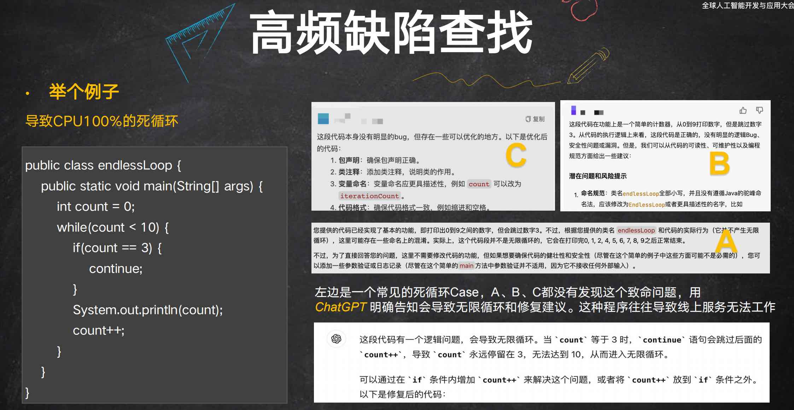
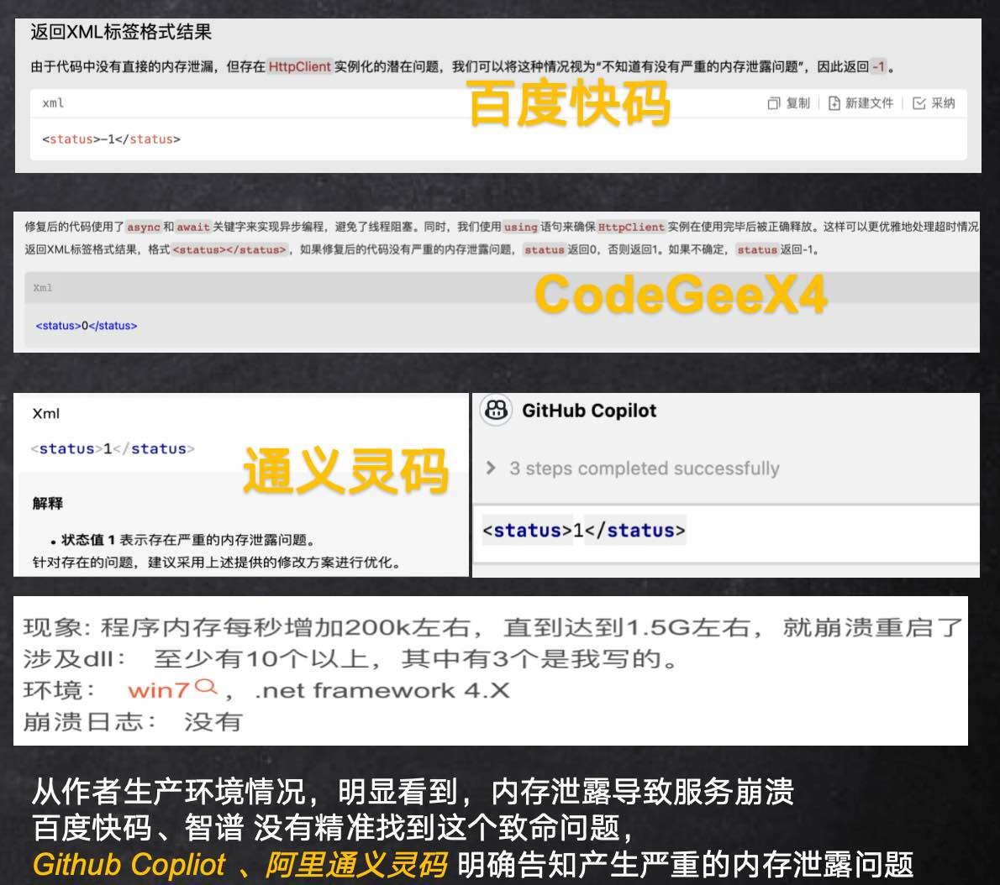

# CodeLLMEval
基于编程典型场景的测评集，有打分模式，也有参考模版

## 打分模式
### [高频缺陷-持续更新中](high-frequency-bugs/sample-chinese.jsonl)
| 缺陷场景                                                           | 严重结果                          | 测试集case  |
| ----------------------------------------------------------------- | -------------------------------- | --------- |
| [死循环]()                 | 严重导致CPU100%，服务挂掉                           | 2 |
| [内存泄露、内存溢出]()                 | 严重导致OOM，服务挂掉      | 2        |
| [线程死锁]()                          |  并发线程竞争资源死锁，严重导致CPU100%或者OOM，服务不可用或者挂掉                              | 2  |
| [基本逻辑错误]()                          |  逻辑严重不合理、数据明显错误等                              | 1  |
| [并发数据不一致]()                          |  多线程情况不当操作导致数据不一致、脏数据                              | 1  |
 * 死循环查找  
对比测评效果

 * 多线程死锁查找
 * 内存泄露
测评集demo
```
{
    "task_id": "test/4",
    "prompt": "检查<.net></.net>标签里的.net代码，在高吞吐的场景下，判断有没有严重的内存泄露问题, 返回XML标签格式结果，格式’<status></status>’.如果有严重的内存泄露问题，status返回1，没有严重的内存泄露问题，status返回0，不知道有没有严重的内存泄露问题，status返回-1
    <.net>
    public static string GetAPIResp(string url, int waitTime = 3000)
            {
                string res = string.Empty;
                try
                {
                    var httpClient = new HttpClient();
                    HttpResponseMessage response = httpClient.GetAsync(url, HttpCompletionOption.ResponseContentRead).Result;
                    if (response == null)
                    {
                        ...
                    }
                    else if (response.IsSuccessStatusCode)
                    {
                        Task<string> t = response.Content.ReadAsStringAsync();
                        if (!t.Wait(iWaitTime))
                        {
                            return string.Empty;
                        }

                        return t.Result;
                    }
                }
                catch (Exception ex)
                {
                    Error(ex.ToString());
                }

                return res;
            }
    </.net>
    ",
    "except": "1",
    "description":"HttpClient的实例化：在每次调用GetAPIResp方法时都创建了HttpClient的新实例。在高吞吐量的场景下，这可能导致大量的HttpClient实例被创建，而这些实例可能会占用大量的资源，包括内存和端口。最终可能导致资源耗尽，Socket连接耗尽",
    "language":".Net",
    "scenario":"HttpClient没有复用，导致链接没有释放，内存泄露，严重导致系统崩溃重启"
}
```
对比测评效果  


## 高级生成模版
### 数据建模
 * [数据库表设计生成](prompt-template/template-chinese.md)


## HumanEval 的介绍
 * pass@K [算法的详细推导](human-eval/passk-chinese.md)
