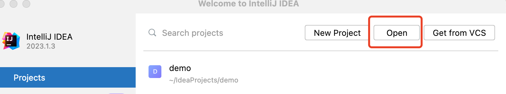
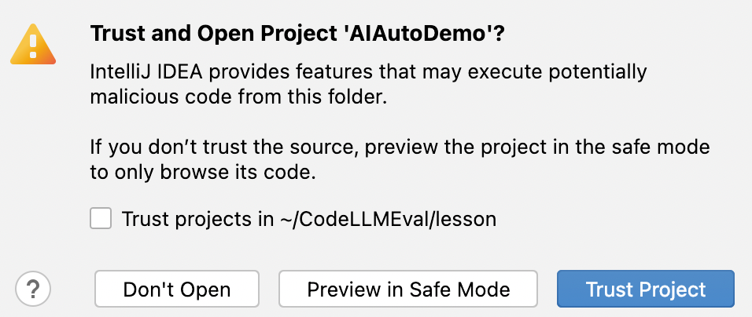
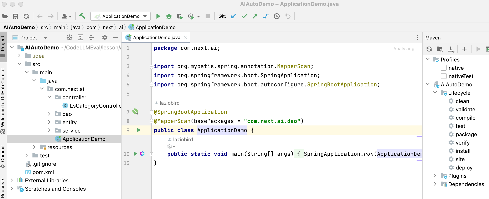

>**完整课件地址**：https://pan.baidu.com/s/197x09nCkyXHJjcRfj4UMuA?pwd=XXXX **付费学员提取码pwd 找极客时间工作人员联系** 😄

### 本教程有四个真实的项目案例：
> ##### AIAutoDemo、0-1、buildDemo 电商产品库前后端系统
> ##### Cursor React 重构的电商产品库前端项目
> ##### FlightSearch 机票搜索系统
> ##### Dental 医疗口腔项目
> ##### 视频教学系统：数据库建模中案例
# 工具介绍

### 使用的编程 IDE 

* Java IntelliJ IDEA
* Python PyCharm
* 前端 WebStorm
* Cursor[加餐课程]

> 相关插件介绍和下载地址
> #### Github Copliot [https://copilot.github.com/](https://copilot.github.com/)
> #### 百度快码Comate  [https://comate.baidu.com/zh](https://comate.baidu.com/zh)
> #### 阿里通义灵码  [https://tongyi.aliyun.com/lingma/](https://tongyi.aliyun.com/lingma/)
> #### 智谱Codegeex  [https://codegeex.cn/](https://codegeex.cn/)

## 如何调入项目案例

以Java AIAutoDemo为例

> [https://github.com/laziobird/CodeLLMEval/tree/main/lesson/AIAutoDemo](https://github.com/laziobird/CodeLLMEval/tree/main/lesson/AIAutoDemo)

#### 1、Open 对应项目根目录


#### 2、点击 Trust Project ，稍等几分钟，项目自动导入完成


#### 3、导入成功


# 案例

### 1、百度提效的案例-P4

智能编程对企业的价值

>[https://comate.baidu.com/zh/scenarios](https://comate.baidu.com/zh/scenarios)
里面包含百度内部、喜马案例采纳率**40%**


### 2、工具企业版的效果-P17

国内外优秀智能编程工具汇总介绍

>百度企业版
>[https://comate.baidu.com/zh/company/homeTrial?token=qj8qpabge&companyId=8jbdo1w6](https://comate.baidu.com/zh/company/homeTrial?token=qj8qpabge&companyId=8jbdo1w6)
>阿里企业版
>https://devops.aliyun.com/lingma/insight
需要单独注册账号


### 3、GithubCopilot付费后台-P19

>[https://github.com/settings/copilot](https://github.com/settings/copilot)
###

### 4、CodeLlama 项目后台-P21

Github 地址

>https://github.com/facebookresearch/codellama
AI 算力平台 PAI [https://pai.console.aliyun.com/](https://pai.console.aliyun.com/)

```java
创建虚拟环境
   conda create --name code_llm python=3.9
   conda activate code_llm
安装机器学习框架 pytorch 
   conda install pytorch torchvision torchaudio \
   pytorch-cuda=12.1 -c pytorch -c nvidia
克隆代码
   git clone https://www.modelscope.cn/models/AI-ModelScope/CodeLlama-7b-hf
   cd CodeLlama-7b-hf
安装依赖
   pip install -e .
   .......

写程序使用代码大模型
   mkdir script
   cd script/
   vim codellama.py
pip install accelerate
运行程序，看辅助代码生成的效果
python codellama.py 
```
 CodeLlama 调用 *Transformer*库实现大模型代码生成的程序 CodeLlama.py
```java
from transformers import AutoTokenizer, AutoModel
import transformers
import torch
modelname = r"/mnt/workspace/CodeLlama-7b-hf"
tokenizer = AutoTokenizer.from_pretrained(modelname)
 
t1 = time.time()
pipeline = transformers.pipeline(
    "text-generation",
    model=modelname,
    torch_dtype=torch.float16,
    device_map="auto",
)
sequences = pipeline(
    '用java实现堆排序',
    do_sample=True,
    top_k=10,
    temperature=0.1,
    top_p=0.95,
    num_return_sequences=1,
    eos_token_id=tokenizer.eos_token_id,
    max_length=500,
)
for seq in sequences:
    print(f"Result: {seq['generated_text']}")
t2 = time.time()
```

### 5、Human Eval Github 项目-P26

>[https://github.com/openai/human-eval](https://github.com/openai/human-eval)
数据集目录

>https://github.com/openai/human-eval/tree/master/data
测评集

>https://github.com/laziobird/CodeLLMEval/blob/main/lesson/HumanEvalFile/HumanEval.jsonl

### 6、Human Eval 造假案例 项目-P28

备注：AI 算力平台 PAI [https://pai.console.aliyun.com/](https://pai.console.aliyun.com/)   

>conda env list
>conda active code_x

### 7、IDE插件 项目-P30

本地模式、云端模式


### 8、代码补全 项目-P32

项目名称 AIAutoDemo

>https://github.com/laziobird/CodeLLMEval/tree/main/lesson/AIAutoDemo


项目名称 FlightSearch 机票搜索系统
>类 SearchTripController
>真实项目，不放完整的项目，放代码片段
>https://github.com/laziobird/CodeLLMEval/blob/main/lesson/FlightSearch/SearchTripController.java

### 9、死循环-P36

```java
这段代码有没有明显的bug，用中文回答
public class endlessLoop {
    public static void main(String[] args) {
        int count = 0;
        while(count < 10) {
            if(count == 3) {
                continue;
            }
            System.out.println(count);
            count++;
        }
    }
}
```


### 9、内存溢出-P37

```java
这段代码有没有明显的bug
public static void main(String[] args) {
        int num = 100; // 需要计算的阶乘
        long factorial = calcFactorial(num); 
       // 调用递归函数计算阶乘
        System.out.println(num + "的阶乘是：" + factorial);
    }
    public static long calcFactorial(int n) {
        if (n == 1) { // 递归结束条件
            return 1;
        } else {
            return n * calcFactorial(n - 1); 
            // 递归调用计算阶乘 }}


```


### 10、内存溢出-P39

>通用开源缺陷测试集
>  [https://github.com/laziobird/CodeLLMEval/blob/main/README_zh.md](https://github.com/laziobird/CodeLLMEval/blob/main/README_zh.md)

### 11、基本逻辑错误，业务专家系统能力-P40

```java
下面的代码有没有问题：
public class ToothConst {
    //牙齿索引数组,按恒牙编号范围，用于转换JSON中的牙齿编号
    public static Integer[] TOOTH_INDEX = {0, 18, 17, 16, 15, 14, 13, 
            12, 11, 21, 22, 23, 24, 25, 26, 
            18, 27, 28, 38, 37, 36, 35, 34, 
            33, 32, 31, 41, 42, 43, 44, 45, 
            46, 47, 48, 49 }; 
     //需要特殊排除的牙齿
    public static Integer[] TOOTH_EXCLUDE = { 101, 103, 95, 96, 206, 206 };}
```


### 12、代码提交注解-P41


### 13、报错排查-P43

AIAutoDemo 项目

>https://github.com/laziobird/CodeLLMEval/tree/main/lesson/AIAutoDemo

### 14、工具库演示-P44

Codex Java 转JSON例子

>请将 JSON 中的 item 对象转为 Java 类，并提供给我这个 Java 文件
对应的JSON 文件

>https://github.com/laziobird/CodeLLMEval/blob/main/lesson/AITool/API.json

# 下半部分

### 15、代码仿写-P2

AIAutoDemo 项目

上传文件Token的仿写

百度快码代码库仿写

```java
参考 LsCategory.java  LsCategoryDao.java LsCategoryDao.xml    编写 LsSpu.java 的相关方法，代码要完整，不要省略
```
通义灵码代码库仿写

### 16、代码仿写-P3

项目AIAutoDemo，加上完整仿写文件上下文的模版改进

```java
参考LsSpu.java, LsCategoryDao.java，LsCategoryDao.xml, 
LsSpu.java 代码:
'
package com.next.ai.entity;


import com.baomidou.mybatisplus.annotation.TableName;
import com.baomidou.mybatisplus.extension.activerecord.Model;
import java.io.Serializable;
import java.util.Date;


/**
 * spu 表(LsSpu)表实体类
 *
 * @author jiangzhiwei
 * @since 2024-09-16 11:45:47
 */
@TableName("ls_spu")
public class LsSpu extends Model<LsSpu> {
    //sku ID
    private Integer id;
    //名称，spu_name + 规格唯一确认
    private String name;
    //编码,规则：类目编码XXXX +idXXXX ,一共8位
    private String code;
    //-1 下架 0 上架
    private Integer status;
    //1 单品 2 套组
    private Integer type;
    //商品描述
    private String remark;
    //一级类目id
    private Integer categoryOneId;
    //二级类目id
    private Integer categoryTwoId;
    //三级类目id
    private Integer categoryThreeId;
    //创建时间
    private Date createdAt;
    //更新时间
    private Date updatedAt;
    //创建用户ID
    private Integer createdUserId;
    //创建用户名
    private String createdUserName;
    //更新用户ID
    private Integer updatedUserId;
    //更新用户名
    private String updatedUserName;
    //版本号
    private Integer version;
    //删除状态 0:未删除；1：已删除
    private Integer deleted;


    public Integer getId() {
        return id;
    }


    public void setId(Integer id) {
        this.id = id;
    }


    public String getName() {
        return name;
    }


    public void setName(String name) {
        this.name = name;
    }


    public String getCode() {
        return code;
    }


    public void setCode(String code) {
        this.code = code;
    }


    public Integer getStatus() {
        return status;
    }


    public void setStatus(Integer status) {
        this.status = status;
    }


    public Integer getType() {
        return type;
    }


    public void setType(Integer type) {
        this.type = type;
    }


    public String getRemark() {
        return remark;
    }


    public void setRemark(String remark) {
        this.remark = remark;
    }


    public Integer getCategoryOneId() {
        return categoryOneId;
    }


    public void setCategoryOneId(Integer categoryOneId) {
        this.categoryOneId = categoryOneId;
    }


    public Integer getCategoryTwoId() {
        return categoryTwoId;
    }


    public void setCategoryTwoId(Integer categoryTwoId) {
        this.categoryTwoId = categoryTwoId;
    }


    public Integer getCategoryThreeId() {
        return categoryThreeId;
    }


    public void setCategoryThreeId(Integer categoryThreeId) {
        this.categoryThreeId = categoryThreeId;
    }


    public Date getCreatedAt() {
        return createdAt;
    }


    public void setCreatedAt(Date createdAt) {
        this.createdAt = createdAt;
    }


    public Date getUpdatedAt() {
        return updatedAt;
    }


    public void setUpdatedAt(Date updatedAt) {
        this.updatedAt = updatedAt;
    }


    public Integer getCreatedUserId() {
        return createdUserId;
    }


    public void setCreatedUserId(Integer createdUserId) {
        this.createdUserId = createdUserId;
    }


    public String getCreatedUserName() {
        return createdUserName;
    }


    public void setCreatedUserName(String createdUserName) {
        this.createdUserName = createdUserName;
    }


    public Integer getUpdatedUserId() {
        return updatedUserId;
    }


    public void setUpdatedUserId(Integer updatedUserId) {
        this.updatedUserId = updatedUserId;
    }


    public String getUpdatedUserName() {
        return updatedUserName;
    }


    public void setUpdatedUserName(String updatedUserName) {
        this.updatedUserName = updatedUserName;
    }


    public Integer getVersion() {
        return version;
    }


    public void setVersion(Integer version) {
        this.version = version;
    }


    public Integer getDeleted() {
        return deleted;
    }


    public void setDeleted(Integer deleted) {
        this.deleted = deleted;
    }
    }
'
,
LsCategoryDao.java 代码:
'
package com.next.ai.dao;


import java.util.List;


import com.baomidou.mybatisplus.core.mapper.BaseMapper;
import org.apache.ibatis.annotations.Mapper;
import org.apache.ibatis.annotations.Param;
import com.next.ai.entity.LsCategory;
import org.springframework.stereotype.Component;
import org.springframework.stereotype.Service;


/**
 * 商品类目(LsCategory)表数据库访问层
 *
 * @author jiangzhiwei
 * @since 2024-07-23 14:06:08
 */
@Mapper
public interface LsCategoryDao extends BaseMapper<LsCategory> {


/**
* 批量新增数据（MyBatis原生foreach方法）
*
* @param entities List<LsCategory> 实例对象列表
* @return 影响行数
*/
int insertBatch(@Param("entities") List<LsCategory> entities);


/**
* 批量新增或按主键更新数据（MyBatis原生foreach方法）
*
* @param entities List<LsCategory> 实例对象列表
* @return 影响行数
* @throws org.springframework.jdbc.BadSqlGrammarException 入参是空List的时候会抛SQL语句错误的异常，请自行校验入参
*/
int insertOrUpdateBatch(@Param("entities") List<LsCategory> entities);


}
',
LsCategoryDao.xml 代码:
'
<?xml version="1.0" encoding="UTF-8"?>
<!DOCTYPE mapper PUBLIC "-//mybatis.org//DTD Mapper 3.0//EN" "http://mybatis.org/dtd/mybatis-3-mapper.dtd">
<mapper namespace="com.next.ai.dao.LsCategoryDao">


    <resultMap type="com.next.ai.entity.LsCategory" id="LsCategoryMap">
        <result property="id" column="id" jdbcType="INTEGER"/>
        <result property="name" column="name" jdbcType="VARCHAR"/>
        <result property="code" column="code" jdbcType="VARCHAR"/>
        <result property="sort" column="sort" jdbcType="INTEGER"/>
        <result property="status" column="status" jdbcType="INTEGER"/>
        <result property="level" column="level" jdbcType="INTEGER"/>
        <result property="parentId" column="parent_id" jdbcType="INTEGER"/>
        <result property="createdAt" column="created_at" jdbcType="TIMESTAMP"/>
        <result property="updatedAt" column="updated_at" jdbcType="TIMESTAMP"/>
        <result property="createdUserId" column="created_user_id" jdbcType="INTEGER"/>
        <result property="createdUserName" column="created_user_name" jdbcType="VARCHAR"/>
        <result property="updatedUserId" column="updated_user_id" jdbcType="INTEGER"/>
        <result property="updatedUserName" column="updated_user_name" jdbcType="VARCHAR"/>
        <result property="version" column="version" jdbcType="INTEGER"/>
        <result property="deleted" column="deleted" jdbcType="INTEGER"/>
    </resultMap>


    <!-- 批量插入 -->
    <insert id="insertBatch" keyProperty="id" useGeneratedKeys="true">
        insert into product.ls_category(name, code, sort, status, level, parent_id, created_at, updated_at, created_user_id, created_user_name, updated_user_id, updated_user_name, version, deleted)
        values
        <foreach collection="entities" item="entity" separator=",">
        (#{entity.name}, #{entity.code}, #{entity.sort}, #{entity.status}, #{entity.level}, #{entity.parentId}, #{entity.createdAt}, #{entity.updatedAt}, #{entity.createdUserId}, #{entity.createdUserName}, #{entity.updatedUserId}, #{entity.updatedUserName}, #{entity.version}, #{entity.deleted})
        </foreach>
    </insert>
    <!-- 批量插入或按主键更新 -->
    <insert id="insertOrUpdateBatch" keyProperty="id" useGeneratedKeys="true">
        insert into product.ls_category(name, code, sort, status, level, parent_id, created_at, updated_at, created_user_id, created_user_name, updated_user_id, updated_user_name, version, deleted)
        values
        <foreach collection="entities" item="entity" separator=",">
            (#{entity.name}, #{entity.code}, #{entity.sort}, #{entity.status}, #{entity.level}, #{entity.parentId}, #{entity.createdAt}, #{entity.updatedAt}, #{entity.createdUserId}, #{entity.createdUserName}, #{entity.updatedUserId}, #{entity.updatedUserName}, #{entity.version}, #{entity.deleted})
        </foreach>
        on duplicate key update
         name = values(name) , code = values(code) , sort = values(sort) , status = values(status) , level = values(level) , parent_id = values(parent_id) , created_at = values(created_at) , updated_at = values(updated_at) , created_user_id = values(created_user_id) , created_user_name = values(created_user_name) , updated_user_id = values(updated_user_id) , updated_user_name = values(updated_user_name) , version = values(version) , deleted = values(deleted)     </insert>


</mapper>
' 
编写 LsSpuDao.java、LsSpuDao.xml，代码要完整，不要省略
```

###

### 17、API文档-P6

Dental 口腔项目对应文件

>[https://github.com/laziobird/CodeLLMEval/blob/main/lesson/Dental/ai/next/controller/AdviseController.java](https://github.com/laziobird/CodeLLMEval/blob/main/lesson/Dental/ai/next/controller/AdviseController.java)
>真实项目，不放完整的项目，放代码片段
API 方法 *AdviseController.java*生成 *Postman*测试模版

```java
生成完整的API文档：带上入参、出参详细介绍，给出完整示例， 格式markdown，给前端调用
```
GitHub Copilot 指定 AdviseController.java 中的 API 接口 *submitExpertAdvise* 生成 *Postman*服务模版
```java
生成submitExpertAdvise 方法的完整API文档：带上入参、出参所有参数的详细中文介绍， 给出完整示例， 格式markdown，给前端调用
```


### 18、单元测试用例-P7

项目名称 AIAutoDemo

>https://github.com/laziobird/CodeLLMEval/tree/main/lesson/AIAutoDemo
百度单元测试用例

```java
请为这段代码生成单元测试；考虑测试边界情况, 使用SpringBootTest , 不要用Mockito。所有字段都要填入数据，对应数据库的表 ’
CREATE TABLE `ls_category` (
  `id` int NOT NULL AUTO_INCREMENT COMMENT '分类ID',
  `name` varchar(50) NOT NULL COMMENT '分类名称',
  `code` varchar(50) NOT NULL COMMENT '分类编码，规则：1000+id，一共4位',
  `sort` int NOT NULL DEFAULT '0' COMMENT '排序，值越低，排靠前',
  `status` tinyint NOT NULL DEFAULT '0' COMMENT '-1 下架 0 上架',
  `level` tinyint NOT NULL DEFAULT '3' COMMENT '类目 1,2,3,一共三级',
  `parent_id` int NOT NULL DEFAULT '0' COMMENT '上级ID，根类目就是 0',
  `created_at` datetime DEFAULT CURRENT_TIMESTAMP COMMENT '创建时间',
  `updated_at` datetime DEFAULT NULL ON UPDATE CURRENT_TIMESTAMP COMMENT '更新时间',
  `created_user_id` int NOT NULL DEFAULT '0' COMMENT '创建用户ID',
  `created_user_name` varchar(100) CHARACTER SET utf8mb4 COLLATE utf8mb4_unicode_ci NOT NULL DEFAULT '' COMMENT '创建用户名',
  `updated_user_id` int NOT NULL DEFAULT '0' COMMENT '更新用户ID',
  `updated_user_name` varchar(100) CHARACTER SET utf8mb4 COLLATE utf8mb4_unicode_ci NOT NULL DEFAULT '' COMMENT '更新用户名',
  `version` int NOT NULL DEFAULT '0' COMMENT '版本号',
  `deleted` tinyint NOT NULL DEFAULT '0' COMMENT '删除状态 0:未删除；1：已删除',
  PRIMARY KEY (`id`),
  KEY `parent_id` (`parent_id`)
) ENGINE=InnoDB AUTO_INCREMENT=2122346499 DEFAULT CHARSET=utf8mb4 COLLATE=utf8mb4_0900_ai_ci COMMENT='商品类目'; ‘  
```


### 19、接口服务测试用例-P9

项目名称 AIAutoDemo

>https://github.com/laziobird/CodeLLMEval/tree/main/lesson/AIAutoDemo
Github Copilot

```java
生成API方法的 Postman Collection 2的JSON文件模版，模版名称”类目后台API”，其中指定了地址127.0.0.1和端口号8099
```
通用灵码、智谱生成模版有问题

### 20、数据库建模技术语言-P

```java
设计一个商品库表：里面有sku表、spu表、类目category表; 
spu和category关系：spu里面有一级、二级、三级类目信息。 
spu和sku关系：一个spu 对应多个sku，规格多有个值，可以用JSON方式保存为一个字段
sku包含第三级类目的信息
每个表都有如下的几个字段:   `remarks` varchar(255) CHARACTER SET utf8mb4 COLLATE utf8mb4_bin DEFAULT NULL COMMENT '备注',
  `create_id` bigint NOT NULL DEFAULT '0' COMMENT '创建人id',
  `update_id` bigint NOT NULL DEFAULT '0' COMMENT '更新人id',
  `create_time` datetime NOT NULL COMMENT '创建时间',
  `update_time` datetime NOT NULL DEFAULT CURRENT_TIMESTAMP ON UPDATE CURRENT_TIMESTAMP COMMENT '更新时间',
返回结果:  所有表所有字段和字段说明的SQL语句
```
### 21、数据库建模产品语言-P

```java
视频点播教学系统，设计表，产品需求如下：
视频管理：视频列表、视频搜索、上下架视频、新增视频、上传视频
课程管理：课程列表、课程搜索、上下架课程、新增课程、
分类管理：新增分类、新增一级分类、一级分类下新增二级分类、分类排序、删除分类
课程关联视频、一个课程会有多个视频。课程关联分类，一个分类下多个课程
视频数据记录表：每个用户观看视频最大时间，观看视频的完成比，记录每个用户的id、name
视频统计信息表：每个视频观看人数、观看次数、观看完成比(每个用户观看视频95%表示视频观看完成)
每个表都有如下的几个字段:   `remarks` varchar(255) CHARACTER SET utf8mb4 COLLATE utf8mb4_bin DEFAULT NULL COMMENT '备注',
  `create_id` bigint NOT NULL DEFAULT '0' COMMENT '创建人id',
  `update_id` bigint NOT NULL DEFAULT '0' COMMENT '更新人id',
  `create_time` datetime NOT NULL COMMENT '创建时间',
  `update_time` datetime NOT NULL DEFAULT CURRENT_TIMESTAMP ON UPDATE CURRENT_TIMESTAMP COMMENT '更新时间',
返回结果:  所有表所有字段和字段说明的SQL语句
```


### 22、RAG 演示效果 -P16

百度快码 知识库

>https://comate.baidu.com/cop/knowledge/detail/NORMAL/0c44afb9-a4fb-4614-9b28-7d8760d38e47
```java
写一段 .net 探针
```
### 23、大模型微调 - P18

>运行环境
>备注：AI 算力平台 PAI [https://pai.console.aliyun.com/](https://pai.console.aliyun.com/)   
>参考的大模型
>DeepSeekCoder-6.7B-Chat
>检查点：train_2024-08-06-14-deepseekcode
```java
这段代码有没有问题:
public class endlessLoop {
  public static void main(String[] args)
  { int count = 0;
    while(count < 10) {
      if(count == 3) { continue; }
      System.out.println(count); count++;
    }
  }
}
```
角色扮演
```java
扮演诸葛亮角色，手机丢了怎么办？
```


### 24、低代码0-1项目构建-P19

项目名称 buildDemo

>https://github.com/laziobird/CodeLLMEval/tree/main/lesson/buildDemo
```java
写一个完整的 Springboot 项目：
1、Idea 构建 Spring 的 Maven 项目，输出构建指令，构建文件是.yaml格式，Project是 buildDemo，GroupId 是 com.aicode ，Package 是 com.aicode.demo
2、将Mysql 的表用 mybatis + Springboot 封装成Dao、Service、Controller ，对应的 mybatis plus 版本 3.5.5，Springboot 版本 3.1.7，Mysql 驱动 8.0.13 ，工具类 hutool-all 5.7.10，lombok ，示例的一个表
"
CREATE TABLE `category` (
  `id` bigint NOT NULL AUTO_INCREMENT COMMENT '主键ID',
  `name` varchar(255) CHARACTER SET utf8mb4 COLLATE utf8mb4_bin NOT NULL COMMENT '类目名称',
  `level` tinyint NOT NULL COMMENT '类目层级 (1, 2, 3)',
  `parent_id` bigint NOT NULL DEFAULT '0' COMMENT '父类目ID',
  `path` varchar(255) CHARACTER SET utf8mb4 COLLATE utf8mb4_bin DEFAULT NULL COMMENT '类目路径',
  `status` tinyint NOT NULL DEFAULT '1' COMMENT '类目状态 (0:禁用, 1:启用)',
  `sort` int NOT NULL DEFAULT '0' COMMENT '排序权重',
  `remarks` varchar(255) CHARACTER SET utf8mb4 COLLATE utf8mb4_bin DEFAULT NULL COMMENT '备注',
  `create_id` bigint DEFAULT '0' COMMENT '创建人id',
  `update_id` bigint DEFAULT '0' COMMENT '更新人id',
  `create_time` datetime DEFAULT NULL COMMENT '创建时间',
  `update_time` datetime DEFAULT CURRENT_TIMESTAMP ON UPDATE CURRENT_TIMESTAMP COMMENT '更新时间',
  PRIMARY KEY (`id`)
) ENGINE=InnoDB AUTO_INCREMENT=14 DEFAULT CHARSET=utf8mb4 COLLATE=utf8mb4_bin COMMENT='商品类目表';
"
3、按创建步骤输出
```
### 多轮对话

```java
第一轮
在 IntelliJ IDEA 中创建一个基于 Spring Boot、MyBatis Plus、MySQL、Lombok 和 Hutool 的项目，对应的 mybatis plus 版本 3.5.5，Springboot 版本 3.1.7，Mysql 驱动 8.0.13 ，工具类 hutool-all 5.7.10
第二轮
将Mysql 的表用 mybatis + Springboot 封装成Dao、Service、Controller ，示例的一个表 " CREATE TABLE category ( id bigint NOT NULL AUTO_INCREMENT COMMENT '主键ID', name varchar(255) CHARACTER SET utf8mb4 COLLATE utf8mb4_bin NOT NULL COMMENT '类目名称', level tinyint NOT NULL COMMENT '类目层级 (1, 2, 3)', parent_id bigint NOT NULL DEFAULT '0' COMMENT '父类目ID', path varchar(255) CHARACTER SET utf8mb4 COLLATE utf8mb4_bin DEFAULT NULL COMMENT '类目路径', status tinyint NOT NULL DEFAULT '1' COMMENT '类目状态 (0:禁用, 1:启用)', sort int NOT NULL DEFAULT '0' COMMENT '排序权重', remarks varchar(255) CHARACTER SET utf8mb4 COLLATE utf8mb4_bin DEFAULT NULL COMMENT '备注', create_id bigint DEFAULT '0' COMMENT '创建人id', update_id bigint DEFAULT '0' COMMENT '更新人id', create_time datetime DEFAULT NULL COMMENT '创建时间', update_time datetime DEFAULT CURRENT_TIMESTAMP ON UPDATE CURRENT_TIMESTAMP COMMENT '更新时间', PRIMARY KEY (id) ) ENGINE=InnoDB AUTO_INCREMENT=14 DEFAULT CHARSET=utf8mb4 COLLATE=utf8mb4_bin COMMENT='商品类目表'; "
```
### 25、后端代码0-1 - P22

后端项目名称 demo

>https://github.com/laziobird/CodeLLMEval/tree/main/lesson/0-1/demo
完善后端项目

```java
1、Category表设计如下，
"
CREATE TABLE `category` (
  `id` bigint NOT NULL AUTO_INCREMENT COMMENT '主键ID',
  `name` varchar(255) CHARACTER SET utf8mb4 COLLATE utf8mb4_bin NOT NULL COMMENT '类目名称',
  `level` tinyint NOT NULL COMMENT '类目层级 (1, 2, 3)',
  `parent_id` bigint NOT NULL DEFAULT '0' COMMENT '父类目ID',
  `path` varchar(255) CHARACTER SET utf8mb4 COLLATE utf8mb4_bin DEFAULT NULL COMMENT '类目路径',
  `status` tinyint NOT NULL DEFAULT '1' COMMENT '类目状态 (0:禁用, 1:启用)',
  `sort` int NOT NULL DEFAULT '0' COMMENT '排序权重',
  `remarks` varchar(255) CHARACTER SET utf8mb4 COLLATE utf8mb4_bin DEFAULT NULL COMMENT '备注',
  `create_id` bigint DEFAULT '0' COMMENT '创建人id',
  `update_id` bigint DEFAULT '0' COMMENT '更新人id',
  `create_time` datetime DEFAULT NULL COMMENT '创建时间',
  `update_time` datetime DEFAULT CURRENT_TIMESTAMP ON UPDATE CURRENT_TIMESTAMP COMMENT '更新时间',
  PRIMARY KEY (`id`)
) ENGINE=InnoDB AUTO_INCREMENT=14 DEFAULT CHARSET=utf8mb4 COLLATE=utf8mb4_bin COMMENT='商品类目表';
"
2、Package 根路径是 com.next.ai
3、使用 MyBatis Plus 3.5.X 自动生成：
完整的实体类 (Category.java)：定义 Category 实体类，Lombok 替换 Get、Set 方法
完整的Mapper 接口 (CategoryDao.java)：定义 CategoryDao 接口，支持新增、批量动态新增、删除、修改、查询
完整的Mapper XML 文件 (CategoryMapper.xml)：支持批量动态插入(返回主键)，Namespace 是com.next.ai.dao
完整的Service 接口 (CategoryService.java)：定义 CategoryService 接口
完整的Service 实现类 (CategoryServiceImpl.java)：实现 CategoryService 接口
完整的Controller 类 (CategoryController.java)：定义 RESTful API 的控制器，批量新增，删除，修改，查询
4、生成SpringBootApplication文件，对应 Springboot版本 3.1.X . 
5、生成 application.yaml ，Mysql 驱动 8.0.X，启动端口8099
```
### 26、完善条件查询-P22

```java
完整的Controller 类 (CategoryController.java)：定义 RESTful API 的控制器，新增，删除，修改，一个多条件查询(id和name入参，name支持模糊搜索)
```
注意：本地运行程序，前端浏览器访问涉及跨域，也可以提示词让AI自动后端代码加上
>@CrossOrigin(origins = "*")
>@RequestMapping("/categories")
>public class CategoryController {
### 27、代码0-1生成Postman 模版-P23

后端API 生成 Postman 模版

>https://github.com/laziobird/CodeLLMEval/blob/main/lesson/0-1/postman_category.json
选择后端项目 *CategoryController.java*

```java
生成API方法的 Postman Collection 2的JSON文件模版，模版名称”电商产品库API”,其中指定了地址127.0.0.1和端口号8099
```
### 28、前端代码0-1 - P23

前端项目名称 demo

>[https://github.com/laziobird/CodeLLMEval/tree/main/lesson/0-1/web-demo](https://github.com/laziobird/CodeLLMEval/tree/main/lesson/0-1/web-demo)
注意：运行前端项目前，先启动后端项目

```java
1、实现一个原生JavaScript + 原生CSS 产品库管理后台，前端代码必须完整
2、页面样式微信风格
3、对应的表
‘
CREATE TABLE `category` (
  `id` bigint NOT NULL AUTO_INCREMENT COMMENT '主键ID',
  `name` varchar(255) CHARACTER SET utf8mb4 COLLATE utf8mb4_bin NOT NULL COMMENT '类目名称',
  `level` tinyint NOT NULL COMMENT '类目层级 (1, 2, 3)',
  `parent_id` bigint NOT NULL DEFAULT '0' COMMENT '父类目ID',
  `path` varchar(255) CHARACTER SET utf8mb4 COLLATE utf8mb4_bin DEFAULT NULL COMMENT '类目路径',
  `status` tinyint NOT NULL DEFAULT '1' COMMENT '类目状态 (0:禁用, 1:启用)',
  `sort` int NOT NULL DEFAULT '0' COMMENT '排序权重',
  `remarks` varchar(255) CHARACTER SET utf8mb4 COLLATE utf8mb4_bin DEFAULT NULL COMMENT '备注',
  `create_id` bigint DEFAULT '0' COMMENT '创建人id',
  `update_id` bigint DEFAULT '0' COMMENT '更新人id',
  `create_time` datetime DEFAULT NULL COMMENT '创建时间',
  `update_time` datetime DEFAULT CURRENT_TIMESTAMP ON UPDATE CURRENT_TIMESTAMP COMMENT '更新时间',
  PRIMARY KEY (`id`)
) ENGINE=InnoDB AUTO_INCREMENT=14 DEFAULT CHARSET=utf8mb4 COLLATE=utf8mb4_bin COMMENT='商品类目表';
‘
4、实现功能：增加、删改、查询商品库(给页面增加按 ID ,name 搜索的功能)的Category页面，
5、通过ajax方式调用后台接口，地址 127.0.0.1:8099
对应的Postman的接口模版文件
{
  "info": {
    "name": "电商产品库API",
    "_postman_id": "12345678-1234-1234-1234-123456789012",
    "description": "API collection for 电商产品库",
    "schema": "https://schema.getpostman.com/json/collection/v2.1.0/collection.json"
  },
  "item": [
    {
      "name": "Get All Categories",
      "request": {
        "method": "GET",
        "header": [],
        "url": {
          "raw": "http://127.0.0.1:8099/categories",
          "protocol": "http",
          "host": ["127", "0", "0", "1"],
          "port": "8099",
          "path": ["categories"]
        }
      }
    },
    {
      "name": "Get Category By ID",
      "request": {
        "method": "GET",
        "header": [],
        "url": {
          "raw": "http://127.0.0.1:8099/categories/:id",
          "protocol": "http",
          "host": ["127", "0", "0", "1"],
          "port": "8099",
          "path": ["categories", ":id"]
        }
      }
    },
    {
      "name": "Search Categories",
      "request": {
        "method": "GET",
        "header": [],
        "url": {
          "raw": "http://127.0.0.1:8099/categories/search?id=:id&name=:name",
          "protocol": "http",
          "host": ["127", "0", "0", "1"],
          "port": "8099",
          "path": ["categories", "search"],
          "query": [
            {
              "key": "id",
              "value": ":id"
            },
            {
              "key": "name",
              "value": ":name"
            }
          ]
        }
      }
    },
    {
      "name": "Add Category",
      "request": {
        "method": "POST",
        "header": [
          {
            "key": "Content-Type",
            "value": "application/json"
          }
        ],
        "body": {
          "mode": "raw",
          "raw": "{\n  \"name\": \"\",\n  \"level\": 0,\n  \"parentId\": 0,\n  \"path\": \"\",\n  \"status\": 1,\n  \"sort\": 0,\n  \"remarks\": \"\",\n  \"createId\": 0,\n  \"updateId\": 0,\n  \"createTime\": \"\",\n  \"updateTime\": \"\"\n}"
        },
        "url": {
          "raw": "http://127.0.0.1:8099/categories",
          "protocol": "http",
          "host": ["127", "0", "0", "1"],
          "port": "8099",
          "path": ["categories"]
        }
      }
    },
    {
      "name": "Update Category",
      "request": {
        "method": "PUT",
        "header": [
          {
            "key": "Content-Type",
            "value": "application/json"
          }
        ],
        "body": {
          "mode": "raw",
          "raw": "{\n  \"id\": 0,\n  \"name\": \"\",\n  \"level\": 0,\n  \"parentId\": 0,\n  \"path\": \"\",\n  \"status\": 1,\n  \"sort\": 0,\n  \"remarks\": \"\",\n  \"createId\": 0,\n  \"updateId\": 0,\n  \"createTime\": \"\",\n  \"updateTime\": \"\"\n}"
        },
        "url": {
          "raw": "http://127.0.0.1:8099/categories",
          "protocol": "http",
          "host": ["127", "0", "0", "1"],
          "port": "8099",
          "path": ["categories"]
        }
      }
    },
    {
      "name": "Delete Category",
      "request": {
        "method": "DELETE",
        "header": [],
        "url": {
          "raw": "http://127.0.0.1:8099/categories/:id",
          "protocol": "http",
          "host": ["127", "0", "0", "1"],
          "port": "8099",
          "path": ["categories", ":id"]
        }
      }
    }
  ]
}
6、CSS 采用外部样式表、JS 独立保存
7、默认页面展示所有Category
```


### 29、仿写后端代码 - P24

后端项目名称 demo

>https://github.com/laziobird/CodeLLMEval/tree/main/lesson/0-1/demo
百度快码模版文件仿写

```java
参考 Category.java CategoryDao.java CategoryMapper.xml CategoryController  
编写 LsSpu.java 和相关方法，代码要完整，不要省略，
数据库表
"
CREATE TABLE `spu` (
  `id` bigint NOT NULL AUTO_INCREMENT COMMENT '主键ID',
  `name` varchar(255) CHARACTER SET utf8mb4 COLLATE utf8mb4_bin NOT NULL COMMENT '商品名称',
  `brand_id` bigint NOT NULL DEFAULT '0' COMMENT '品牌ID',
  `category1_id` bigint NOT NULL DEFAULT '0' COMMENT '一级类目ID',
  `category2_id` bigint NOT NULL DEFAULT '0' COMMENT '二级类目ID',
  `category3_id` bigint NOT NULL DEFAULT '0' COMMENT '三级类目ID',
  `description` text CHARACTER SET utf8mb4 COLLATE utf8mb4_bin COMMENT '商品描述',
  `status` tinyint NOT NULL DEFAULT '1' COMMENT '商品状态 (0:下架, 1:上架)',
  `remarks` varchar(255) CHARACTER SET utf8mb4 COLLATE utf8mb4_bin DEFAULT NULL COMMENT '备注',
  `create_id` bigint NOT NULL DEFAULT '0' COMMENT '创建人id',
  `update_id` bigint NOT NULL DEFAULT '0' COMMENT '更新人id',
  `create_time` datetime NOT NULL COMMENT '创建时间',
  `update_time` datetime NOT NULL DEFAULT CURRENT_TIMESTAMP ON UPDATE CURRENT_TIMESTAMP COMMENT '更新时间',
  PRIMARY KEY (`id`)
) ENGINE=InnoDB DEFAULT CHARSET=utf8mb4 COLLATE=utf8mb4_bin;
"
```


单步仿写

```java
参考    仿写 SpuController.java , 对应 Spu.java 对应的数据库表
"
CREATE TABLE `spu` (
  `id` bigint NOT NULL AUTO_INCREMENT COMMENT '主键ID',
  `name` varchar(255) CHARACTER SET utf8mb4 COLLATE utf8mb4_bin NOT NULL COMMENT '商品名称',
  `brand_id` bigint NOT NULL DEFAULT '0' COMMENT '品牌ID',
  `category1_id` bigint NOT NULL DEFAULT '0' COMMENT '一级类目ID',
  `category2_id` bigint NOT NULL DEFAULT '0' COMMENT '二级类目ID',
  `category3_id` bigint NOT NULL DEFAULT '0' COMMENT '三级类目ID',
  `description` text CHARACTER SET utf8mb4 COLLATE utf8mb4_bin COMMENT '商品描述',
  `status` tinyint NOT NULL DEFAULT '1' COMMENT '商品状态 (0:下架, 1:上架)',
  `remarks` varchar(255) CHARACTER SET utf8mb4 COLLATE utf8mb4_bin DEFAULT NULL COMMENT '备注',
  `create_id` bigint NOT NULL DEFAULT '0' COMMENT '创建人id',
  `update_id` bigint NOT NULL DEFAULT '0' COMMENT '更新人id',
  `create_time` datetime NOT NULL COMMENT '创建时间',
  `update_time` datetime NOT NULL DEFAULT CURRENT_TIMESTAMP ON UPDATE CURRENT_TIMESTAMP COMMENT '更新时间',
  PRIMARY KEY (`id`)
) ENGINE=InnoDB DEFAULT CHARSET=utf8mb4 COLLATE=utf8mb4_bin;
"
```
### 30、仿写前端代码-P24

>[https://github.com/laziobird/CodeLLMEval/tree/main/lesson/0-1/web-demo](https://github.com/laziobird/CodeLLMEval/tree/main/lesson/0-1/web-demo)
```java
参考  Tongyi.html 、Tongyi.css 、Tongyi.js , 仿写 Spu 和相关代码，不要省略，
1、Spu 对应的数据库表 ".........."
2、实现功能：增加、删改、查询 Spu (给页面增加按 ID ,name 搜索的功能)的 Spu 页面
3、对应的Postman的接口模版文件{ }
```

### Cursor 功能亮点实操

>[https://github.com/laziobird/CodeLLMEval/tree/main/lesson/Cursor](https://github.com/laziobird/CodeLLMEval/tree/main/lesson/Cursor)

### Cursor 功能亮点 Composer
React 重构
>[https://github.com/laziobird/CodeLLMEval/tree/main/lesson/Cursor/category-management](https://github.com/laziobird/CodeLLMEval/tree/main/lesson/Cursor/category-management)


### 31、企业级智能编程解决方案介绍-P29

```java
百度快码企业后台
https://comate.baidu.com/zh/company/homeTrial
通义灵码企业后台
https://devops.aliyun.com/lingma/insight
```


### 32、官方AI 编程落地案例-P32

[https://tongyi.aliyun.com/lingma/](https://tongyi.aliyun.com/lingma/)

[https://comate.baidu.com/zh/scenarios](https://comate.baidu.com/zh/scenarios)


### 33、企业提效SOP : AI 提效达到50-80%的质变关键-P35

备注：需要注册 codewave.163.com 相关账号

1、低代码模板库

```java
https://community.codewave.163.com/CommunityParent/CodeWaveMarket?navia=&currentType=%E6%90%9C%E6%A8%A1%E6%9D%BF&userId=
```
2、试用低代码平台，开发一个小程序coffee 网站
```java
https://futrueman.codewave.163.com/designer/app?appId=09ba44d6-a247-43a0-8ea6-399a736f7369
```


